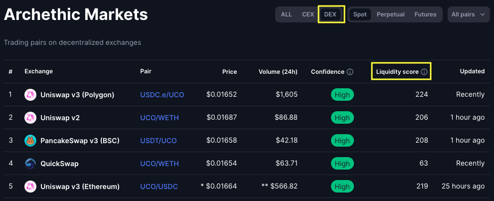
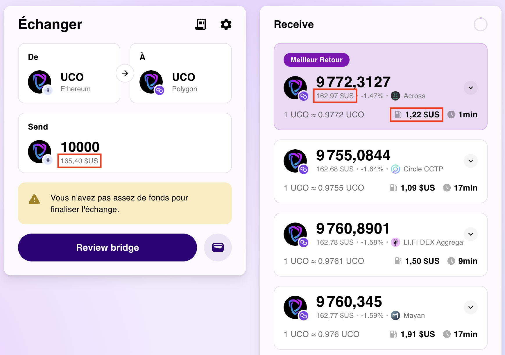

# Archives

## D'€ à UCO
*Il s'agit de l'ancienne version du guide, elle est volontairement très détaillée, mais ne sera plus forcément à jour (en fonction des évolutions du projet).*

### 1. Déplacer ses €

> **Pré-requis :** avoir des € à investir et disponibles depuis un compte à votre nom. Petit rappel : ce guide n'est pas un conseil en investissement, n'investissez que ce que vous êtes prêt à perdre.

En admettant que votre point de départ soit une monnaie fiat et en l'occurence des €, vous allez nécessairement devoir passer par un acteur centralisé et donc un KYC (Know You Customer) qui est une contrainte réglementaire.

Dans la pratique vous avez 2 possibilités :

1. Un plateforme **on-ramp**, qui est une entreprise à laquelle vous allez faire un virement en € et qui va en échange vous envoyer l'équivalent en valeur en stablecoin sur votre wallet EVM. Actuellement, <a href="https://monerium.com/" target="_blank">Monerium</a> est la principale solution utilisée par la communauté en tant que plateforme on-ramp.
2. Un CEX, désolé. Les CEX occupent encore une place centrale dans l'écosystème car ils se conforment à la réglementation et en particulier au KYC. Vous pouvez donc avoir recours à leurs services pour envoyer vos € et les convertir en stablecoin ou en cryptos que vous enverrez ensuite vers votre propre wallet EVM. Quelques règles de sécurité avec les CEX :
    - Privilégiez des CEX connus : Binance, Kraken, Coinbase.
    - Laissez-y vos fonds le moins longtemps possible (vous n'êtes pas à un jour près, mais **ne laissez pas vos fonds à durée indéterminée sur un CEX**).

### 2. Où sont les UCO
Avant d'effectuer réellement des transactions, il y a une notion très importante à saisir : ***où sont les UCO ?*** Si vous avez bien suivi jusqu'ici, la réponse devrait vous venir : dans les DEX. D'accord, donc la question devient : ***où sont les DEX qui contiennent des UCO alors ?***

Facile, vous les retrouverez à 2 endroits :
- Sur <a href="https://coinmarketcap.com/currencies/archethic/#Markets" target="_blank">CoinMarketCap</a> pour les DEX basés sur Ethereum (cliquez sur le bouton DEX pour les filtrer).
- Directement sur aeSwap côté Archethic (onglet <a href="https://swap.archethic.net/poolList?tab=verified" target="_blank">Pools</a>).

*Sur CoinMarketCap, chaque ligne correspond à une pool de liquidités et la colonne "Liquidity score" vous indique les pools qui ont la liquidité la plus élevée :*

*Pour en savoir plus sur une pool précise, cliquez simplement sur sa paire **USCD.e/UCO** par exemple et regardez ses informations en haut à gauche. Sur la copie d'écran suivante, la pool la plus remplie est USDC.e/UCO sur Uniswap v3 et elle contient l'équivalent de **$57,000** au cours actuel :*

*Sur Archethic c'est plus simple, l'onglet pools vous offre déjà une vue d'ensemble. Sur la copie d'écran ci-dessous, vous pouvez voir que la pool aeETH/UCO contient l'équivalent de **$390,000** sur la copie d'écran ci-dessous :*

Maintenant, que pouvez-vous faire des ces informations :
1. L'optimisation vous importe peu, vous ne voulez pas vous prendre la tête : vous allez vouloir échanger des UCO dans la pool qui contient le plus de volume.
2. Vous voulez optimiser votre swap : vous avez déterminé où se trouvent les liquidités et allez pouvoir approfondir.

### 3. Achetez des UCO

> **Pré-requis (important)** :
> - Pour financer les transactions sur **Polygon**, BSC et Ethereum vous aurez besoin respectivement de **POL**, de BNB et d'ETH (en fonction du réseau choisi). Si vous avez besoin de quelques poussières de **POL** ou de BNB, vous devez soit les acheter et les retirer depuis un CEX, soit solliciter la communauté pour être dépanné (cela est particulièrement important si vous utilisez Monerium car votre nouveau wallet ne contiendra évidement pas de **POL**). Une fois que quelqu'un vous a dépanné, pensez (1) à acheter un peu de **POL** en prévision pour plus tard et (2) à dépanner à votre tour quelqu'un quand l'occasion se présente.
> - **Polygon est le réseau avec les frais les moins élevés** il est donc particulièrement adapté pour les personnes souhaitant faire des achats récurrents ou les petits montants.

Cas A : **Si vous voulez acheter sans vous prendre la tête**, achetez là où il y a le plus de liquidités (à savoir : dans la pool aeETH/UCO d'Archethic au moment où ce guide est rédigé). Voici les étapes pour le faire :

1. Acheter de l'ETH. **Objectif : avoir des WETH sur votre wallet EVM.**
    - Si vous passez via l'**EURe** (Monerium), vous serez sur le réseau Polygon et <a href="https://swap.defillama.com/?chain=polygon&from=0x18ec0a6e18e5bc3784fdd3a3634b31245ab704f6&tab=swap&to=0x7ceb23fd6bc0add59e62ac25578270cff1b9f619" target="_blank">LlamaSwap</a> est l'outil qu'il vous faut.
    - Si vous venez d'un CEX, achetez de l'ETH sur ce dernier puis effectuez un retrait vers votre wallet EVM sur le réseau **Polygon**, **ne retirez pas vos ETH sur le réseau Ethereum car vous allez payer des frais inutiles**.
 2. Bridger votre WETH vers le réseau Archethic. **Objectif : avoir des aeETH sur votre aeWallet.**
     - Pour cela c'est très simple : utilisez <a href="https://bridge.archethic.net/bridge" target="_blank">aeBridge</a>.
  3. Échange de vos aeETH pour du UCO. **Objectif : avoir des UCO sur votre aeWallet**.
     - Très simple également : utilisez <a href="https://swap.archethic.net/swap" target="_blank">aeSwap</a>.
     - **Attention** :
	     - Si vous voulez participer au [farming](#farming), n'échangez pas plus de 50% de vos aeETH en UCO.
         - **N'échangez, ni ne transférez jamais la totalité de vos UCO depuis votre aeWallet**, car vous serez ensuite dans l'incapacité d'effectuer d'autres transactions sur le réseau Archethic (le UCO est requis pour payer les frais de transactions). Une recommandation est de créer une deuxième adresse dans la **keychain** de votre aeWallet et d'y envoyer quelques dizaines de UCO en prévention.

Cas B : **Si vous êtes déjà familier avec l'écosystème crypto et que vous cherchez à optimiser votre achat de UCO**. Cela est particulièrement pertinent si vous avez déjà des cryptomonnaies et une bonne connaissance globale de l'écosystème. Ce guide ne peut pas couvrir la démarche idéale à l'instant où vous lisez car cette dernière varie du jour lendemain. Je vais néanmoins essayer de vous donner des conseils et exemples que vous pourrez facilement appliquer à l'instant T.

- Prenez connaissance des <a href="#o%C3%B9-sont-les-uco" target="_blank">pools de liquidités existantes</a>.
- Utilisez <a href="https://coinmarketcap.com/currencies/archethic/#Markets" target="_blank">CoinMarketCap</a> pour voir si le UCO est significativement moins cher dans une des pools.
- Déterminez **quels sont vos avoirs et vos possibles points de départ** (crypto, stablecoin, blockchain, exchange).
- En fonction des réponses aux précédentes questions : utilisez LlamaSwap et essayez diverses combinaisons sur différentes blockchains comme : <a href="https://swap.defillama.com/?chain=polygon&from=0x3c499c542cef5e3811e1192ce70d8cc03d5c3359&to=0xaa53B93608C88EE55fAD8db4C504Fa20E52642aD" target="_blank">USDC/UCO sur Polygon</a> ou encore <a href="https://swap.defillama.com/?chain=bsc&from=0x55d398326f99059ff775485246999027b3197955&to=0xf1e5bbd997501a8439619266A09a54b2b499eAA3" target="_blank">USDT/UCO sur BSC</a> (en fonction des pools de liquidités que vous avez identifiées à la 1ère étape).
- Utilisez <a href="https://swap.archethic.net/swap" target="_blank">aeSwap</a> pour faire la même chose côté Archethic.
- N'oubliez pas que :
	- Les CEX ont des frais de retrait et des commissions sur les trades.
	- Les bridges ont des frais.
	- Les frais des swaps sont déjà inclus dans les prévisualisations des swappers.
	- Certaines blockchains sont plus chères que d'autres (Ethereum > BSC > **Polygon**).
- En fonction de tous ces éléments, déterminez si une option est réellement plus intéressante qu'une autre.

Il n'y a pas de solution directe à cette équation complexe, et **à ce jour aucun outil n'existe pour automatiser cela**. Pire que cela, le temps que vous compariez les situations, elles auront peut-être déjà bougé alors prudence ! Au moins vous savez comment tout cela fonctionne.

## Sortir de Zebitex

**Première chose à savoir :** les frais de **aeBridge** vers Archethic <a href="https://medium.com/archethic/aebridge-update-fees-bootstrap-transfers-0f7af5ff4918" target="_blank">sont désormais de 0%</a>. Attention, cela ne signifie pas que la transaction sera gratuite mais simplement que vous n'aurez que les frais de transactions (dit gas fees) à financer. Ce sont donc ces frais que nous allons chercher à minimiser.

>Pré-requis :
>- Un wallet EVM installé et configuré : <a href="https://rabby.io/" target="_blank">Rabby</a> est recommandé.
>	 - Identifiez l'adresse de votre wallet, elle nous servira par la suite.
>	 - Vous devez avoir des ETH sur le réseau Ethereum (prévoyer ~$50 pour être large).
>	 - et potentiellement des MATIC sur le réseau Polygon (~$3) si vous voulez optimiser les frais.
>- aeWallet installé et configuré.

#### 1. Retirer vos UCO de Zebitex dans votre wallet EVM

C'est la seule étape indispensable pour se mettre en sécurité.

1. Connectez-vous sur Zebitex
2. Allez dans "**Mon portfolio**"
3. Dans la ligne UCO, cliquez sur "**Retirer**"
4. **Saisissez le montant choisi ainsi que l'adresse de destination** (celle de votre wallet Rabby ou MetaMask)
	- À cette étape, Zebitex prélève une commission fixe de 200 UCO qui sert à payer les frais de gas du réseau Ethereum.
5. Procéder aux différentes confirmations requises pour valider le retrait (MFA, email...).
	- D'ici quelques dizaines de minutes au plus vous devriez voir apparaître les UCO dans votre wallet :
	  - Sur MetaMask il faudra ajouter manuellement le token.
	  - Sur Rabby ces derniers devraient apparaître directement.
	- Vous pouvez suivre l'avancement de la transaction depuis l'interface de Zebitex.

Une fois cette étape finalisée, vous pouvez respirer !
- Vos UCO ne seront plus convertis de force par Zebitex.
- Vous êtes désormais réellement propriétaire de vos UCO.
- Vous n'êtes pas obligé d'aller plus loin car vos UCO sont déjà en sécurité. **À condition que vous ayez bien fait une sauvegarde de la seed phrase de votre wallet EVM**.

#### 2. Identifier la solution de migration la plus optimisée

Si vous voulez migrer vos UCO jusqu'au mainnet d'Archethic, vous pouvez poursuivre. Cette étape est un peu plus complexe car nous allons comparer les frais de gas de différents réseaux pour choisir la meilleure solution de bridge.

> Pour ceux qui lisent ceci hors du cadre de la sortie d'un CEX : si vos UCO sont déjà sur Polygon ou BSC migrez directement depuis ce dernier, ce sera dans tous les cas la solution la plus optimisée. En revanche si vos UCO sont sur Ethereum, poursuivez la lecture.

#### **Scénario A : bridge directement d'Ethereum vers Archethic.**

1. Aller sur <a href="https://bridge.archethic.net/bridge" target="_blank">aeBridge</a> et configurez comme ceci :
	- From **Ethereum** - To **Archethic**
	- Select a token **UCO**
4. Saisissez le montant et confirmez sur **aeBridge**.
5. **Ne signez pas la première transaction de votre wallet EVM**. À la place **notez les frais de gas indiqués**.

#### Scénario B : bridge de Ethereum vers Polygon puis de Polygon vers Archethic
> Remarques :
>- N'oubliez pas qu'il vous faudra du MATIC une fois sur Polygon pour effectuer le deuxième bridge.
>- Nous considérons dans ce scénario que les frais en MATIC du réseau Polygon sont négligeables.

1. Aller sur <a href="https://app.rango.exchange/bridge?fromBlockchain=ETH&fromToken=UCO--0x8a3d77e9d6968b780564936d15b09805827c21fa&toBlockchain=POLYGON&toToken=UCO--0x3c720206bfacb2d16fa3ac0ed87d2048dbc401fc&fromAmount=10000" target="_blank">Rango</a> et sur <a href="https://jumper.exchange/fr/?fromAmount=10000&fromChain=1&fromToken=0x8a3d77e9d6968b780564936d15B09805827C21fa&toChain=137&toToken=0x3C720206bFaCB2d16fA3ac0ed87D2048Dbc401Fc" target="_blank">Jumper</a> et **simulez la transaction** avec les UCO en votre possession.
3. Sur les 2 agrégateurs, calculer la valeur de **coût** = **gas fees + price impact**. Je vous laisse regarder les copies d'écran pour savoir comment faire sur l'un et l'autre.

*Sur Jumper : 165.40 - 162.97 + 1.22 = **$3.65***

*Sur Rango : 165.26 - 164.14 + 1.85 = **$2.97***

#### 3. Exécutez le bridge le plus économe

**Si les frais du scénario A sont inférieurs au scénario B**, finalisez simplement ce scénario. Pour cela il vous suffit de valider les différentes transactions proposées par votre wallet EVM et votre aeWallet à l'étape 3 du scénario A (plusieurs minutes requises en général). **Résultat : vos UCO sont désormais dans votre aeWallet !**

**Si les frais du scénario B sont inférieurs :**
1. **Choisissez la solution la plus économique entre Rango et Jumper**.
2. Validez les différentes transactions sur l'agrégateur choisi (les 2 agrégateurs vous donne un ordre d'idée de la durée du processus de bridge).
3. Si tout s'est bien passé, **vos UCO se trouveront toujours dans votre wallet EVM mais cette fois-ci sur le réseau Polygon**. *Si vous utilisez MetaMask, vous allez surement devoir changer manuellement de réseau à nouveau et ajouter le token **UCO** sur Polygon.*
4. Rendez-vous ensuite sur <a href="https://bridge.archethic.net/bridge" target="_blank">aeBridge</a> et configurez comme ceci :
	- From **Polygon** - To **Archethic**
	- Select a token **UCO**
7. Confirmez le bridge puis validez la série de transactions proposées par votre wallet EVM et votre aeWallet (1 à 2 minutes en général).

**Résultat : vos UCO sont désormais dans votre aeWallet !**

> **Si vous ne voulez pas vous prendre la tête**, le scénario A est plus simple et comporte moins d'étapes, mais sachez que ça n'est en général pas le plus optimisé. En particulier si le bridge échoue pour une raison inconnue. Personnellement, je ne vous conseille pas cette solution.

**Important** : en cas d'échec d'un bridge via **aeBridge**, ne videz pas le cache de votre navigateur et contactez l'équipe via le Telegram officiel (@ArchEthic_ENG).

Si  vous-êtes toujours en difficulté pour sortir vos UCO de Zebitex, un membre de la communauté a réalisé <a href="https://www.youtube.com/watch?v=n4t3zTXP8eU" target="_blank">cette vidéo</a> qui vous accompagnera de A à Z.
<!--stackedit_data:
eyJoaXN0b3J5IjpbLTc0OTE1MTIxMF19
-->