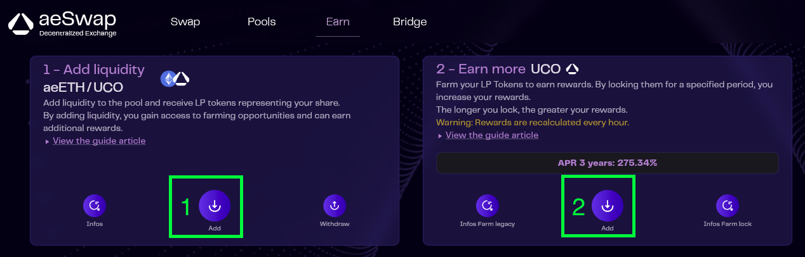

# UCO pour les nuls

> **Dernière mise à jour 24/10/2024**
>   - Refonte partie "**d'€ à UCO**" (<a href="archives.html#d€-à-uco" target="_blank">archivage</a> de l'ancienne)
>   - Quelques correction mineures.
>
>**Mise à jour le 09/10/2024**
>   - Ajout de la section "Migration"
>   - Ajout d'une page [d'archives](archives.html)
>   - Section "Sortir de Zebitex" archivée
>   - Relecture complète & mise à jour des liens pour tenir compte des évolutions de l'écosystème.
>   
>**Mise à jour le 02/01/2025**
>   - Ajout d'un lien vers la page de l'AMA d'Archethic avec ProBit du 25/10/2024
>   - Ajout de la section "Airdrop"

## Préambule

*Ce guide n'est pas un guide officiel Archethic. Les guides officiels se trouvent dans le <a href="https://wiki.archethic.net/" target="_blank">Knowledge Center</a> d'Archethic.*

Ce guide existe car les ressources Archethic officielles actuellement à disposition sont principalement rédigées en anglais et cela peut-être bloquant pour les personnes ne parlant pas l'anglais. De plus, ce guide pourrait servir de **base de connaissance / référence au sein du Telegram Archethic FR** pour répondre à des questions fréquemment posées.

Pour couronner le tout, ce guide est hébergé sur le mainnet d'Archethic ! Sachez que chaque mise à jour de ce guide coûte quelques UCO.

Les objectifs de ce guide sont au nombre de 3 :
- Vous donner **les bases de la finance décentralisée (DeFi)**. Notion indispensable pour comprendre l'écosystème Archethic.
- Vous présenter de manière globale l'**écosystème Archethic** et ce qui s'y passe actuellement.
- Enfin, vous partager des notions pratiques vous permettant notamment d'**investir et de s'investir dans Archethic de manière autonome** en respectant des bonnes pratiques.

## Liens utiles
- <a href="https://statikformation.shinyapps.io/dashboard_farm_uco/" target="_blank">Tableau de bord farming</a> (par @stoik25)
- <a href="https://www.youtube.com/@UniversArchethic-rv6oe" target="_blank">Chaîne YouTube "Univers Archethic"</a> (par Arnolito)
- <a href="https://www.archethic.net/wallet.html" target="_blank">aeWallet</a> - <a href="https://swap.archethic.net/swap" target="_blank">aeSwap</a> - <a href="https://bridge.archethic.net/bridge" target="_blank">aeBridge</a> - <a href="https://migration-uco.archethic.net/" target="_blank">Migration UCO v1 vers v2</a> - <a href="https://swap.archethic.net/earn" target="_blank">Farming</a> (outils officiels Archethic)
- <a href="https://ucopourlesnuls.fr/probit-ama.html" target="_blank">Résumé de l'AMA d'Archethic avec ProBit du 25/10/2024"</a> (par Kuaaaly)

## Vocabulaire indispensable
- **Smart Contract** : en français, contrats intelligents. Vous pouvez imaginer que certaines blockchains sont d'énormes ordinateurs. **Les smarts contracts sont simplement des logiciels sur ces ordinateurs, visibles et utilisables par tous.** Toutes les blockchains ne permettent pas de déployer des smart contracts. Ethereum est la blockchain la plus connue qui permet de le faire, Archethic supporte également les smart contracts. **Tous les outils de la DeFi sont basés sur des smart contracts** (DEX, bridge, etc).

- **DeFi** (**De**centralized **Fi**nance) : ce terme vient de l'anglais et signifie **fi**nance **dé**centralisée. Le principe est simple, échanger de la valeur sans intermédiaire de confiance. Concrètement : se passer des banques ou des plateformes d'échanges centralisées. **Ce sont donc des smart contracts qui orchestrent l'écosystème DeFi**.

- **CEX** (**C**entralized **Ex**change) : aussi appelés échanges centralisés ou parfois brokers. Les CEX sont des plateformes **mises en place et maintenues par des entreprises**. Ces plateformes (accessibles via un site internet ou une application mobile en général) vous permettent principalement d'échanger des cryptomonnaies. Quand vous "possédez" des cryptomonnaies sur un CEX, **vous ne les possédez pas réellement** : les administrateurs du CEX les possèdent. Ils sont les seuls à en détenir les clés privées. D'où l'adage bien connu **"not your keys not your crypto"**. Il y a beaucoup à dire sur les CEX, nous y reviendrons peut-être plus tard. Binance, Coinbase ou encore Kraken sont des exemples de CEX.

- **DEX** (**D**ecentralized **Ex**change) : en opposition aux CEX, il s'agit de plateforme d'échange dont le fonctionnement est régi par des smart contracts, donc de manière décentralisée. Quand vous interagissez avec des DEX, **vous êtes donc seul maître à bord et propriétaire de vos fonds**. **<a href="https://app.uniswap.org/pool" target="_blank">Uniswap</a>** est le DEX le plus utilisé "côté" Ethereum. **<a href="https://raydium.io/liquidity-pools/" target="_blank">Raydium</a>** est son homologue sur Solana.

- **Hot wallet** : en tant qu'utilisateur de la DeFi vous aurez nécessairement besoin d'un portefeuille. Un hot wallet est un portefeuille qui se présente sous forme de **logiciel que vous exécutez localement sur votre téléphone ou sur votre ordinateur (application, extension de navigateur)**. Ce dernier vous permet notamment d'approuver les transactions permettant de gérer vos cryptomonnaies. Nous reviendrons plus en détail sur cet aspect dans la partie écosystème. <a href="https://rabby.io/" target="_blank">Rabby</a> et <a href="https://metamask.io/" target="_blank">MetaMask</a> sont les 2 wallets les plus populaires compatibles avec la blockchain Ethereum (et ses différentes variantes, dites **blockchains EVM**). Les **hot wallets ne sont pas les seuls wallet existants** mais ce sont eux qui vont nous intéresser dans ce guide pour leur facilité d'utilisation et leur gratuité.

- **Swap** :
  - Fonctionnellement : swap veut dire "**échanger**". "Swap" est donc l'**action d'échanger une cryptomonnaie X pour une cryptomonnaie Y**. Il s'agit d'un outil fondamental de la **DeFi**.
  - Techniquement : une plateforme de swap (que j'appelerai **swapper**) va vous permettre d'**interagir avec plusieurs DEX afin d'optimiser un échange**. <a href="https://app.1inch.io/#/1/simple/swap/ETH" target="_blank">1inch</a> et <a href="https://www.odos.xyz/" target="_blank">Odos</a> sont des swappers côté Ethereum, <a href="https://jup.ag/" target="_blank">Jupiter</a> est un swapper côté Solana. La plupart des DEX ont en général leur propre swapper, c'est le cas d'Uniswap et de Raydium, mais ces derniers sont rarement optimisés (car ils ne se basent que sur leur propres pools de liquidités). D'où l'intérêt d'utiliser un swapper qui agrège plusieurs DEX comme <a href="https://www.odos.xyz/" target="_blank">Odos</a>.

- **Swap aggregator** : il s'agit d'un agrégateur de swappers. Les swappers agrègent les DEX et les **swap aggregators** agrègent les swappers. Cela vous permet de bénéficier du **meilleur taux parmi tous les swappers pris en charge par l'agrégateur**. Oui ça commence à devenir compliqué mais rassurez vous c'est le dernier niveau. L'outil le plus connu et le plus utilisé est <a href="https://swap.defillama.com/?chain=polygon&from=0x0000000000000000000000000000000000000000&tab=swap" target="_blank">LlamaSwap</a>, régulièrement mentionné sur le Telegram.

- **Bridge** : il s'agit de **passer d'une cryptomonnaie X d'une blockchain A à une cryptomonnaie X' d'une valeur équivalente sur une blockchain B**. Un exemple très concret de la vie de tous les jours : **au casino, vous donnez 100€ en liquide à l'entrée, le guichetier vous donne 100 jetons ayant une valeur de 1€**. Vous avez effectué un bridge. Vous pouvez jouer avec ces jetons dans le casino. Quand vous partez, vous repassez au guichet pour échanger vos jetons contre des €, vous effectuez donc un bridge dans l'autre sens (sauf si le guichetier est parti avec la caisse entre-temps). En crypto c'est exactement la même chose. <a href="https://v2.across.to/bridge" target="_blank">Across</a> est un exemple de bridge.

- **Bridge aggregator** : à l'instar des swappers, il existe aussi des agrégateurs pour les bridges. Ces derniers **permettent d'agréger à la fois les bridges et les swappers** vous permettant ainsi de passer d'une cryptomonnaie X sur une blockchain A à une cryptomonnaie Y sur une blockchain B et ce de manière optimisée à l'instant T. <a href="https://app.rango.exchange/bridge" target="_blank">Rango</a> et <a href="https://jumper.exchange/fr/" target="_blank">Jumper</a> sont les agrégateurs les plus souvent mis en avant.

- **Coin vs token** : **un coin est la pièce native d'un réseau** et permet de financer, entre autres, les transactions sur ce réseau (BTC est le coin de Bitcoin, ETH est le coin d'Ethereum et UCO est le coin d'Archethic). **Un token est une représentation de valeur régie par un smart contract sur une blockchain** (sur Ethereum, on parle de token ERC20). À cet égard, les **UCO** sur Polygon, BSC et Ethereum sont des tokens, le **WETH** sur Polygon et l'**aeETH**  sur Archethic sont également des tokens. **Les tokens ont une valeur et une utilité seulement parce qu'un smart contract leur en donne**. Pensez de nouveau à l'analogie du casino citée précédemment : si vous retournez au guichet et que le casino n'accepte pas d'échanger vos 100 jetons contre 100€, je vous mets au défi d'aller payer vos courses de la semaine avec les jetons ! **Une cryptomonnaie est soit un coin soit un token (pièce vs. jetons)**.

## Archethic

L'enjeu va être de taille dans cette partie ! Nous avons deux objectifs : 
- Comprendre de quoi est constitué l'écosystème Archethic
- Apprendre à l'utiliser

### Pré-ambule
Nous parlons souvent de "la blockchain Archethic" et bien cette première notion est inexacte. **Archethic n'est pas une blockchain**. Archethic est une transaction chain. Je ne souhaite pas me risquer à la vulgarisation de cette partie technique car j'ai peur de faire des erreurs, je vous renvoie donc vers le <a href="https://wiki.archethic.net/learn/transaction-chain" target="_blank">centre de connaissance</a> d'Archethic (en anglais).

Quoiqu'il en soit, sachez que dire "**transaction chain**" (abrégé TC) est techniquement exact. Dire "**blockchain**" (abrégé BC) est techniquement incorrect dans le cas d'Archethic mais **est tout à fait compréhensible**.

**Un peu d'histoire indispensable** : Archethic est un projet qui est initialement né sur la blockchain Ethereum. De ce fait, **le UCO (le coin d'Archethic) est né sur Ethereum** (sous forme de token ERC20 si vous avez bien suivi). C'est donc pour cette raison qu'il y a de nombreux détenteurs d'UCO ERC20 (nous aborderons plus tard l'aspect migration v1 / v2). Ce n'est que quelques années plus tard qu'Archethic a lancé son propre réseau (mainnet). Le UCO est devenu à ce moment là un coin natif. **Un UCO en token ERC20 (sur un réseau de type Ethereum) ne peut pas être envoyé directement vers un wallet Archethic (et réciproquement)**, cela est techniquement impossible. C'est pour cela que le bridge, aeBridge, existe. Pour permette aux détenteurs de UCO ERC20 de les bridger vers Archethic pour désormais posséder des UCO natifs (dit coins).

Ce que nous appelons "outils" de l'écosystème Archethic sont des applications décentralisées (Dapps). Comme vous l'avez probablement deviné, **le fonctionnement de ces applications est régi par des contrats intelligents** eux-mêmes déployés sur la transaction chain Archethic.

### aeWallet
Vous pouvez considérer qu'**un wallet est au web 3.0 ce qu'un compte utilisateur est au web 2.0**. Sans compte sur le web 2.0, vous n'avez pas de boîte mail, pas d'espace client, etc. **Sans wallet sur le web 3.0 vous ne pouvez pas utiliser les outils à disposition**.

**<a href="https://www.archethic.net/wallet.html" target="_blank">aeWallet</a> est un portefeuille logiciel** (aussi appelé **hot wallet** ou aussi **soft wallet**), il prend la forme d'une extension de votre navigateur, d'une application de smartphone ou d'ordinateur. Dans tous les cas, sa fonction est la même : vous permettre d'interagir sur le mainnet Archethic.

Lorsque vous configurez aeWallet pour la première fois (quelque soit la plateforme), ce dernier va vous fournir une **seed phrase**. En français, nous pouvons traduire ce terme par **graine**. Cette graine est **une suite de 24 mots** et elle doit absolument :
1. Rester privée, **vous ne devez en aucun cas la partager**. Quiconque a connaissance de votre seed phrase sera en mesure de restaurer votre wallet sur son appareil et donc d'accéder à vos fonds.
2. Être très **précieusement sauvegardée**. Effectivement elle vous permet à vous aussi de restaurer votre wallet au cas où vous auriez un soucis avec l'appareil sur lequel vous l'aviez initialement configuré (casse, vol, perte).

Une fois votre wallet installé et configuré, c'est avec ce dernier que vous pourrez effectuer (signer) des transactions et donc recevoir des fonds, en envoyer, déployer des contrats intelligents et utiliser des applications décentralisées sur Archethic.

Il est important de noter qu'**un même wallet peut-être utilisé sur plusieurs appareils physiques différents simultanément**. C'est tout l'intérêt de la **seed phrase**. Vous pouvez avoir votre wallet sur n'importe quel appareil compatible dans le monde. **Vos fonds ne sont pas associés à votre téléphone ou votre ordinateur mais bel et bien à votre seed phrase** qui est en réalité un moyen cryptographique de détenir vos fonds sur la transaction chain.

### aeSwap

<a href="https://swap.archethic.net/swap" target="_blank">aeSwap</a> rassemble 3 outils :
- Un swapper (onglet <a href="https://swap.archethic.net/swap" target="_blank">Swap</a>) qui vous permet d'échanger une cryptomonnaie X contre une cryptomonnaie Y au sein de l'écosystème.
- Des pools de liquidités (onglet <a href="https://swap.archethic.net/poolList" target="_blank">Pools</a>) qui vous permettent de mettre à disposition des liquidités au sein de l'écosystème.
- Du farming (onglet <a href="https://swap.archethic.net/earn" target="_blank">Earn</a>) qui vous permet de gagner des récompenses grâce à votre implication financière dans l'écosystème. Nous verrons plus en détail le sujet dans la [partie farming](#farming).

Comme nous l'évoquions dans la section vocabulaire, un DEX a souvent sa propre interface de swap, aeSwap n'échappe pas à la règle. Si nous voulons être extrêmement précis au niveau des termes, **un DEX est techniquement composé d'un système de pools de liquidités et d'un swapper qui utilise ces mêmes pools de liquidités**. En ce sens, aeSwap est un DEX.

### aeBridge

Comme l'indique la section vocabulaire, un bridge permet de passer d'une cryptomonnaie X d'une blockchain A à une cryptomonnaie X' de valeur équivalente sur une blockchain B. En l'occurence, <a href="https://bridge.archethic.net/bridge" target="_blank">aeBridge</a> permet de bridger les cryptomonnaies suivantes vers et depuis Archethic :

| Blockchain destination / source | Crypto | Équivalent sur Archethic |
|--|--|--|
| BSC | UCO - BTCB - WETH | UCO - aeBTC - aeETH |
| Polygon | UCO - WBTC - WETH - EURe | UCO - aeBTC - aeETH - aeEURe |
| Ethereum | UCO - EURe | UCO - aeEURe |

### Migration

> **Attention** : **le process de migration n'est ni un bridge, ni un swap**, donc les outils tels que LlamaSwap ou Jumper n'ont rien à voir avec cette opération. La migration est simple et expliquée dans les paragraphes qui suivent.

Le **07/10/2024**, l'équipe Archethic a mis à disposition un outil de migration du token UCO ERC20 historique (désormais surnommé **UCO ERC20 v1**) vers un nouveau token UCO ERC20 (surnommé **UCO ERC20 v2**). Les pages <a href="https://coinmarketcap.com/currencies/archethic/" target="_blank">CoinMarketCap</a> et <a href="https://www.coingecko.com/fr/pi%C3%A8ces/archethic" target="_blank">CoinGecko</a> sont correctement associées à ce nouveau token. Il faudra surement quelques jours pour qu'elles soient totalement à jour mais vous y retrouverez toutes les informations utiles (contrats, DEX, métriques).

#### Pourquoi l'équipe a-t-elle créé un nouveau token ?

Les raisons sont données par la team, en anglais, sur le <a href="https://wiki.archethic.net/FAQ/migration-erc-token/" target="_blank">Wiki</a>. Pour ceux ne parlant pas anglais, voici les 2 raisons évoquées :
- Mise à jour des informations du token, notamment son nom et sa supply totale.
- Uniformisation du token ERC20 sur les 3 blockchains EVM (Ethereum, Polygon, BSC). Sans rentrer dans le détail : le token v2 disposera désormais de fonctionnalités équivalentes sur les différentes blockchains EVM ce qui facilitera certaines opérations.

#### Quelques questions / réponses qui reviennent fréquemment

- **J'ai mes UCO sur ProBit, dois-je faire quelque chose ?**
	- Non. ProBit prendra en charge la migration sans action de votre part.
- **J'ai des UCO ERC20 v1 dois-je les migrer ?**
	- À terme, oui, car le token v1 a vocation à disparaître et il n'est plus liquide (difficilement échangeable) car les pools de liquidités ont été transférées vers le token v2. Quoiqu'il en soit, il n'y a pas d'urgence pour faire la migration donc prenez le temps de le faire prochainement, quand vous aurez la tête à cela.
- **J'ai mes UCO sur aeWallet, dois-je faire la migration ?**
	- Non. La notion de v1 / v2 n'existe pas sur le mainnet. **Si vous avez vos UCO sur aeWallet il s'agit de UCO natif** (coin) et non pas de token ERC20, il n'y a donc aucune action à faire. Si cela est flou, je vous invite à revoir la notion de **coin vs token** dans la section vocabulaire de ce guide.
- **Puis-je bridger mes UCO ERC20 vers le mainnet Archethic ?**
	- Oui, de la même manière qu'avant la migration, mais ces derniers doivent désormais (depuis le 07/10/2024) être des **UCO ERC20 v2**. Si vous avez des UCO ERC20 v1 vous devrez au préalable les migrer vers la v2.

#### Comment migrer mes UCO ERC20 v1 vers la v2?
Si vous avez lu les 3 paragraphes précédents, vous aurez normalement compris que vous êtes concernés uniquement si vous avez des UCO ERC20 v1 sur votre propre wallet.

Si tel est le cas, il vous suffit de vous rendre sur <a href="https://migration-uco.archethic.net/" target="_blank">la plateforme de migration officielle</a> d'Archethic, de **connecter votre wallet EVM** au site et de procéder à la migration. Cela se fait en quelques minutes et requiert la signature de 2 transactions : une 1ère qui approuve le nombre de tokens à migrer suivie d'une 2ème qui procède réellement à l'envoi pour les migrer.

- **Aucune commission n'est prélevée sur vos UCO migrés,** il vous faudra en revanche payer les frais de transactions (gas fees) qui seront respectivement en BNB, POL ou ETH en fonction de votre réseau EVM (BSC, Polygon et Ethereum).
- De nombreuses méthodes de connexion pour votre wallet sont disponible sur le site de migration. Vous pourrez par exemple utiliser Rabby, Phantom ou bien Wallet Connect. À titre d'exemple (et car la question revient fréquemment) pour les utilisateurs Ledger : installez simplement l'extension Rabby, connectez votre Ledger à Rabby puis connectez vous avec Rabby sur le site de migration. Vous n'avez aucunement besoin d'envoyer vos UCO depuis votre wallet Ledger vers un hot wallet (comme MetaMask ou Rabby).

## S'investir

Après tout ce blabla sur l'écosystème, vous avez normalement le bagage requis pour mettre les mains dedans. Alors allons-y !

Premièrement, cette partie s'appelle "**s'investir**" et non pas "**investir**", et c'est volontaire. Pourquoi cela ? Et bien parce que **investir dans Archethic c'est commencer par s'investir dans les technologies décentralisées**. Tout cela nécessite des recherches, de la réflexion, des efforts de compréhension, des échanges avec la communauté. Bref : du temps, et c'est exactement la différence entre **investir** et **s'investir**. Je vous garanti que n'importe qui peut le faire quelque soit son capital et son niveau de départ.

### Apprendre, comprendre et expliquer

C'est accessible à tout le monde et si vous avez lu ce guide jusqu'ici sachez que vous vous êtes déjà investis. **Vous avez fait l'effort d'apprendre et de comprendre, et vous êtes désormais en mesure d'expliquer et de transmettre !**

### Construire dans l'écosystème
Archethic est une technologie nouvelle, qui met à disposition des outils. Si vous êtes technophile, vous pouvez vous approprier ces outils pour **concevoir vos propres applications décentralisées**.

Un exemple : <a href="https://dpix.app/" target="_blank">dPix</a> est une Dapp de type Pixel War développée sur Archethic.

### D'€ à UCO

Il existe une <a href="archives.html#d€-à-uco" target="_blank">ancienne version</a> plus détaillée de cette partie. Je ne vous en conseille pas spécialement la lecture sauf si vous souhaitez avoir davantage de précisions techniques. **La partie ci-après, nouvellement rédigée, est plus accessible pour les novices.**

> **Pré-requis :**
>- aeWallet installé et configuré.
>- Un wallet EVM installé et configuré : <a href="https://rabby.io/" target="_blank">Rabby</a> est recommandé.
>- Process réalisé et testé sur ordinateur, probablement transposable à quelques détails près sur smartphone.

#### 1. Achat depuis un CEX
Je ne vais pas rentrer dans le détail pour cette méthode car elle est simple Créez-vous un compte sur  <a href="https://www.mexc.com/" target="_blank">MEXC</a> ou sur  <a href="https://www.probit.com/" target="_blank">ProBit</a> alimentez ce dernier par la méthode de votre choix, puis **achetez vos UCOs en ordre au marché ou en ordre limite**. Une fois cela fait, je vous conseille vivement de les retirer vers votre propre wallet. Hot wallet ou cold wallet, à vous de choisir.

#### 2. Achat depuis un DEX
> **Rappel indispensable** : en fonction du/des réseau(x) sur lesquels vous allez faire vos transactions, **vous aurez des frais de transactions (gas fees) à payer (ETH, BNB, POL, UCO)**. Il vous faut donc alimenter votre wallet en conséquence pour financer ces frais. Si vous ne comprenez pas ce que vous venez de lire c'est que vos connaissances en DeFi ne sont pas encore suffisantes. Je vous invite donc à faire de plus amples recherches avant de lire la suite.

La page <a href="https://coinmarketcap.com/currencies/archethic/#Markets" target="_blank">CoinMarketCap</a> du UCO vous permet de voir rapidement où vous pouvez acheter du UCO. Il faut ajouter aeSwap à cette liste, car il n'est pas référencé. Vos **4 options d'achat via des DEX** (au moment de la rédaction de ce guide) sont donc les suivantes (les liens cliquables des paires ci-dessous vous emmène directement vers LlamaSwap):

1. Sur la BSC via la paire <a href="https://swap.defillama.com/?chain=bsc&from=0x55d398326f99059ff775485246999027b3197955&to=0xf1e5bbd997501a8439619266A09a54b2b499eAA3" target="_blank">USDT/UCO</a>
2. Sur Polygon via la paire <a href="https://swap.defillama.com/?chain=polygon&from=0x3c499c542cef5e3811e1192ce70d8cc03d5c3359&to=0xaa53B93608C88EE55fAD8db4C504Fa20E52642aD" target="_blank">USDC/UCO</a>
3. Sur Ethereum via la paire <a href="https://swap.defillama.com/?chain=ethereum&from=0xa0b86991c6218b36c1d19d4a2e9eb0ce3606eb48&to=0x1A688D3d294ee7BcC1f59011DE93d608Dc21c377" target="_blank">USDC/UCO</a>
4. Sur aeSwap via la paire <a href="https://swap.archethic.net/swap" target="_blank">aeETH/UCO</a> (lien non pré-configuré).

- Dans les cas 1, 2, 3 il s'agit d'un achat sur EVM (donc du token ERC20), au besoin vous pouvez configurer <a href="https://swap.defillama.com/" target="_blank">LlamaSwap</a> pour partir d'un token de départ différent (par exemple <a href="https://swap.defillama.com/?chain=polygon&from=0x18ec0a6e18e5bc3784fdd3a3634b31245ab704f6&tab=swap&to=0xaa53B93608C88EE55fAD8db4C504Fa20E52642aD" target="_blank">l'EURe</a> si vous êtes un utilisateur de <a href="https://monerium.app/" target="_blank">Monerium</a>).
- Dans le cas 4, il vous faudra des aeETH pour réaliser le swap, pour cela vous devrez donc acheter des ETH sur la BSC, Polygon ou Ethereum et ensuite les <a href="https://bridge.archethic.net/bridge" target="_blank">bridger</a> vers le mainnet Archethic.

### Farming
Bon. Quand il faut y aller, il faut y aller. Pour commencer : qu'est ce que le farming ? Désolé de vous décevoir, mais en l'état, dans l'écosystème crypto, **ce mot est un fourre-tout qui n'est pas associé à quelque chose de précis techniquement**. Cela étant, communément, **le farming consiste en général à investir du temps ou de l'argent dans l'espoir d'une récompense ultérieure valorisable**. C'est donc pour cela que l'on parle de "farmers" de airdrops (investissement de temps), ou bien de farming comme celui d'Archethic (investissement / immobilisation de capital).

> **Attention** : le farming sur Archethic n'est pas du staking.

#### Le principe du farming sur Archethic
Le <a href="https://swap.archethic.net/earn" target="_blank">farming</a> sur Archethic repose sur **un principe simple et sain : la mise à disposition de liquidités**. Cela incite les investisseurs à immobiliser leur capital pour rendre le UCO "plus liquide" ce qui veut dire : plus facilement échangeable. **Les investisseurs qui jouent le jeu sont récompensés en UCO**.

La pool de liquidités choisie par l'équipe pour ce système est **la pool aeETH/UCO**. C'est donc dans cette pool que vous devrez apporter des liquidités pour pouvoir ensuite participer au farming. **Techniquement : vous apportez le capital de votre choix composé de 50% de valeur en UCO et 50% de valeur en aeETH**. Évidement, vous devez posséder ce capital sur votre aeWallet pour effectuer les transactions.
> Exemple : vous souhaitez déposer $1000 dans la pool, il vous faudra $500 de UCO (29,700 UCO au cours du 26/08/2024)  et $500 d'aeETH (0.18 ETH au cours du 26/08/2024).

Lors du dépôt, vos UCO et vos aeETH sont envoyés vers la pool de liquidités et **vous recevez en échange des LP tokens**. Ces LP tokens sont un récépissé qui indique quelle est votre part dans la pool de liquidités. Le jour où vous voudrez récupérer votre capital, vous pourrez échanger ces LP tokens contre les UCO et les aeETH qui vous reviennent. Notez que j'ai écrit "**les** UCO et **les** aeETH" et non pas "**vos** UCO et **vos** aeETH", car lorsque vous mettez à disposition des cryptomonnaies dans une pool de liquidités les quantités de ces dernières vont changer (en fonction des échanges dans la pool elle-même). En fonction de cela, vous récupérerez **nécessairement** des quantités différentes de celles déposées. Le potentiel manque à gagner dû à cela s'appelle l'**impermanent loss** (IL ou perte non-permanente), vous verrez également la notion de **divergent loss** (DL ou perte de divergence) qui est de plus en plus utilisée.

#### Le divergent loss (= impermanent loss)
Je vais tenter de vous l'expliquer au travers d'un exemple, mais sachez que c'est une notion compliquée à appréhender et que cet exemple simpliste comporte par nature des imprécisions.

Imaginez **une boutique qui permet l'échange de pommes contre des bananes et inversement**. La boutique possède :
- 100 bananes pour un équivalent de 500€.
- 400 pommes pour un équivalent de 500€.
- Mathématiquement : 1 banane vaut donc 4 pommes.
- 1 banane se valorise donc 5€.
- 1 pomme se valorise donc 1,25€.

De votre côté, vous avez des pommes et des bananes, vous voulez en fournir à la boutique pour que ces fruits servent dans des échanges. Vous fournissez :
- 25 bananes (équivalent à 125€)
- 100 pommes (équivalent à 125€)
- On retrouver bien notre ratio de 50/50 en valeur

La boutique prend vos bananes et vos pommes et vous donne un récépissé indiquant que **vous posséder 20% du stock global de fruits** = 250 / (1000 + 250) = 20%. Mathématiquement, et c'est le principe d'une pool de liquidités, l'équivalent en valeur d'une pomme et d'une banane n'a pas changé lors de l'ajout de vos fruits. À savoir 1 banane vaut toujours 4 pommes. La seule chose qui a changé c'est le nombre de fruits dans la boutique.

**La boutique compte donc désormais 1250€ de fruits:**
- 125 bananes
- 500 pommes
- dont 20% ont été fournis par vous.

Demain, **M. Michu** arrive avec 100 pommes et souhaite les échanger contre des bananes. Avec le taux actuel, 1 banane = 4 pommes, M. Michu peut donc échanger 100 pommes contre son équivalent en bananes soit 25 bananes. **Après cet échange, la valeur globale de l'ensemble des fruits n'a pas changée mais la proportion de ces derniers a évoluée.**

La boutique compte donc toujours 1250€ de fruits dont :
- 600 pommes
- 100 bananes

La règle mathématique qui régit cette pool de liquidités dit que 50% de la valeur est représenté par les pommes (625€) et 50% par les bananes (625€). De ce fait :
- Une pomme vaut : 625€ / 600 ≃ 1,04€
- Une banane vaut : 625€ / 100 = 6,25€

Les prix ont donc évolué.

Après-demain, vous souhaitez récupérer la proportion de pommes et de bananes qui vous revient de droit. Vous allez donc à la boutique avec votre récépissé. Vous allez recevoir 20% des pommes et 20% des bananes, soit :
- 20% x 600 = 120 pommes. Pour un équivalent en valeur de 120 * 1,04 ≃ 125€
- 20% x 100 = 20 bananes. Pour un équivalent en valeur de 20 x 6,25 ≃ 125€

Vous récupérez **un équivalent en valeur de 250€**. Dans notre exemple, cette valeur correspond à notre dépôt initial car nous négligeons la présence potentielle d'autres boutique de fruits ainsi que la potentielle variation de la valeur des pommes et des bananes en dehors de la boutique, mais **sachez que cette valeur aurait pu être inférieure à votre dépôt initial**.

Seulement, **si vous aviez gardé vos pommes et vos bananes sans les mettre à disposition** vous auriez :
- 25 bananes x 6,25€ = 156,25€
- 100 pommes x 1,04€ = 104€

Soit **une valeur globale de 260,25€**.

250€ - 260,25€ = **-10,25€**. Ceci est ce qu'on appelle le **divergent loss** (ou impermanent loss). **Cette valeur est forcément négative ou nulle**.

> Par soucis de simplicité, j'ai fait une approximation sur ce dernier calcul, car nous devrions théoriquement refaire les calculs **sans notre apport en fruits** avant l'échange de M. Michu. **Cela amplifierait davantage le divergent loss**.

Je suis donc en train de vous dire qu'en mettant à disposition des liquidités **vous allez subir le divergent loss quoiqu'il arrive et donc perdre de la valeur**. Alors pourquoi mettre à disposition ses liquidités ?

#### Pourquoi cela peut-il être intéressant ?

##### Dans les pools de liquidités "normales"
Il y a un détail dont je n'ai pas parlé dans mon exemple : **quand M. Michu vient pour échanger ses pommes, il paie une commission** (qui correspondrait dans notre cas à ~1 pomme, soit 1%), et cette commission est partagée entre toutes les personnes qui mettent à disposition des pommes et des bananes. Si demain **M. Michu2** vient échanger des bananes contre des pommes, hop, vous percevez à nouveau une commission, etc, etc.

**Quand vous participez à une pool de liquidités, vous cherchez à ce que les commissions que vous allez générer couvrent votre divergent loss.**

##### Sur Archethic
Dans le cas d'Archethic, **la pool de liquidités aeETH/UCO (sur laquelle s'applique le farming) n'a pas de frais de commission**, donc vous ne pouvez pas espérer couvrir votre divergent loss de cette manière.

À la place, Archethic a mis en place un système de récompense dit de "**farming**", qui consiste en 2 étapes :
1. **Mettre à disposition des liquidités** dans la pool **aeETH/UCO** (toujours 50/50 en valeur apportée). Vous recevez un nombre de LP tokens qui correspond à votre part dans la pool de liquidités.
2. **Immobiliser les LP tokens reçus** pour la période de votre choix (7 niveaux possibles allant de 1 semaine à 3 ans). Évidement **plus la période de verrouillage est longue plus le rendement annuel est élevé**.

Les 2 principaux avantages de ce système de récompenses sont les suivants :
- Stabiliser l'écosystème en **incitant les investisseurs à immobiliser leur capital** pendant des périodes fixes et connues de tous évitant ainsi les mouvements réguliers de capitaux et le day-trading.
- Disposer d'un **important volume de liquidités pour les nouveaux entrants** qui peuvent donc plus facilement investir sur le projet par l'intermédiaire du UCO.

#### Comment farmer ?
Tout se passe sur le DEX d'Archethic, dans l'<a href="https://swap.archethic.net/earn" target="_blank">onglet Earn</a>.

1. Utilisez l'encart "**Add liquidity**" pour déposez des aeETH et des UCO dans la pool afin de recevoir des LP tokens. N'oubliez pas : vous devrez nécessairement déposer 50/50 en valeur.
2. Une fois en possession de vos LP tokens, utilisez l'encart "**Earn more UCO**" pour les immobiliser pour la période de votre choix et gagner des récompenses.

Enfin, quelques notions qui pourraient faciliter votre compréhension du sujet :
- APR : Annuel Percentage Rate. Cela correspond au **rendement annualisé estimé sur votre capital immobilisé.** Si vous immobilisez $1000, que l'APR est de 100%, vous gagnerez théoriquement $1000 en UCO/an.
- Une fois en farming, vos LP tokens ainsi que les récompenses associées sont **verrouillés jusqu'à la fin de la période choisie**.
- Les récompenses accumulées pendant la période de farm ne sont pas ré-investies, mais pourront l'être à la fin de la période de blocage (à condition d'apporter l'équivalent en aeETH évidement).
- Plus il y a de liquidités en farm, plus l'APR baisse.
- L'évolution des cours de l'aeETH et du UCO font évoluer l'APR à la hausse comme à la baisse étant donné que ce dernier est calculé sur une base en $.

Si vous voulez en savoir encore plus sur les récompenses de farming, je vous inviter à consulter ce <a href="https://statikformation.shinyapps.io/dashboard_farm_uco/" target="_blank">tableau de bord</a> développé par un membre de la communauté.

### Airdrop UCO

Archethic a annoncé un airdrop de 100 000 000 $ en tokens UCO. Cette distribution aura lieu dès que le prix du token UCO atteindra 1$ .
Pour référence, le prix le plus élevé atteint par le UCO jusqu'à présent est de 0,73 $

#### Comment participer à l'airdrop ?

Pour être éligible à cet airdrop, deux étapes sont nécessaires :

1. **Rejoindre la liste d'attente du Cold Wallet d'Archethic** :
Pour cela, il vous faut:
- Aller sur la page dédiée à l'airdrop [ici](https://www.archethic.net/uco-airdrop)
- Saisir une adresse email valide dans la section prévue à cet effet
- Cliquer sur le bouton "Join now"

**Note**: En vous inscrivant, vous recevrez des mises à jour sur l'avancement du portefeuille avant tout le monde.

2. **Soutenir l'écosystème Archethic et gagner des récompenses** : 
Participez au programme de revenus passifs en ajoutant des liquidités au pool ETH/UCO, puis en stakant vos tokens de pool de liquidité (LP). Plus vous fournissez de liquidités, plus votre multiplicateur dans l'airdrop sera élevé. 
Autrement dit il faut participer au farming sur Archethic.

u'est le farming sur Archethic vous pouvez relire la section farming.
Pour savoir comment participer au farming sur Archethic ?
Pour lessi vous ne savez pas ce que c'est il suffit de suivre le 

Pour plus de détails, visitez la page officielle de [l'airdrop d'Archethic](https://www.archethic.net/uco-airdrop).

**Note** : Une fonctionnalité est en cours de développement pour afficher en temps réel votre statut de participation et le montant de la récompense à laquelle vous avez droit.

En participant à cet airdrop, vous soutenez l'écosystème Archethic et augmentez vos chances de recevoir des tokens UCO supplémentaires.
<!--stackedit_data:
eyJoaXN0b3J5IjpbLTEyOTE4MTMyMjUsLTU0ODg4ODIxOSw1Nj
E0NTYzMTUsLTQ4NTcxNDU2Ml19
-->